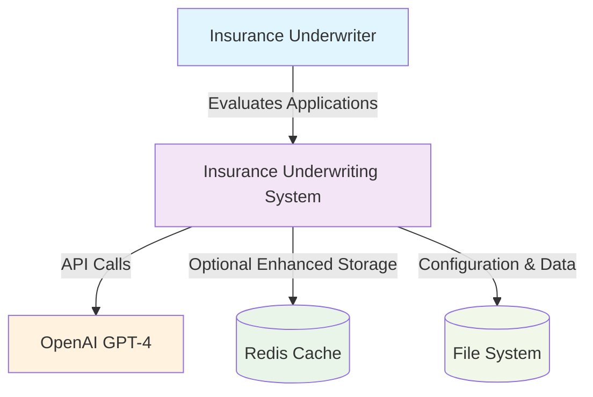
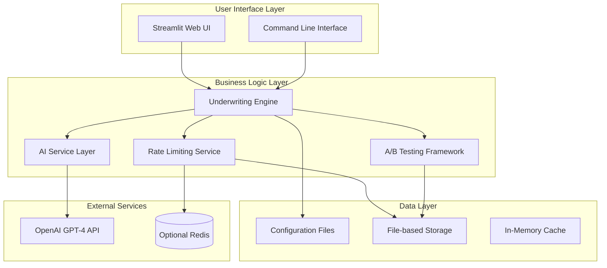
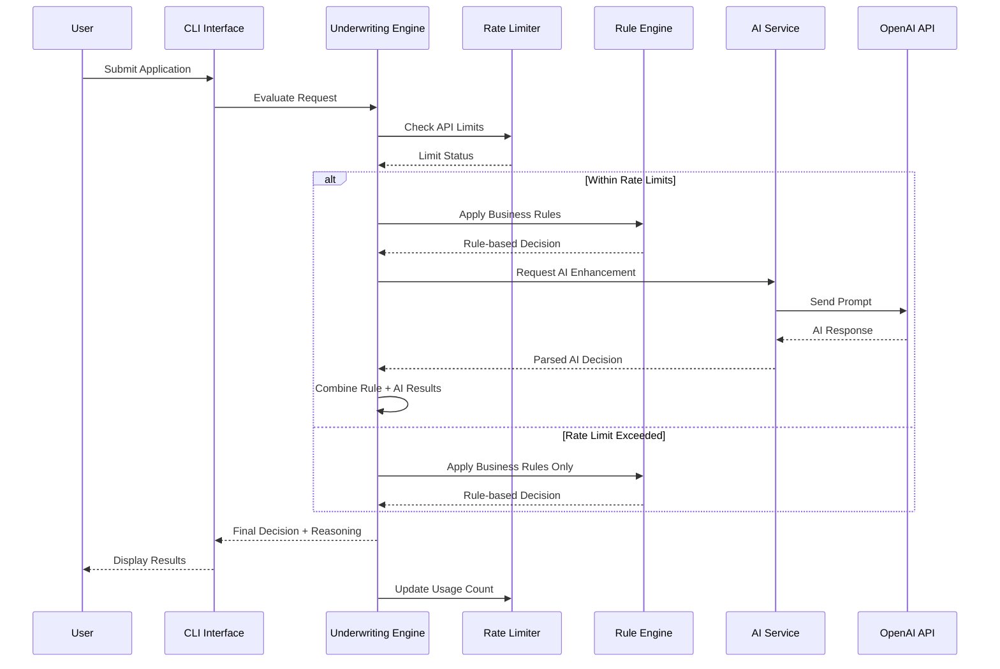
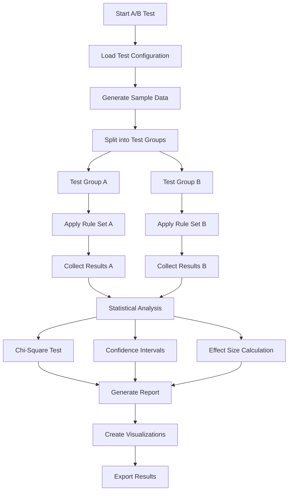

# Portfolio Project - Insurance Underwriting System

A comprehensive Python-based automobile insurance underwriting system with AI enhancement, configurable rules, A/B testing capabilities, and rate limiting for production deployment.  This is a portfolio project that is created, managed and maintained by [Jeremiah Connelly](https://jeremiahconnelly.dev)

## 📋 Table of Contents

- [Overview](#overview)
- [Features](#features)
- [Architecture](#architecture)
- [Installation](#installation)
- [Quick Start](#quick-start)
- [Configuration](#configuration)
- [CLI Usage](#cli-usage)
- [API Usage](#api-usage)
- [Rule Sets](#rule-sets)
- [AI Integration](#ai-integration)
- [A/B Testing Framework](#ab-testing-framework)
- [Rate Limiting System](#rate-limiting-system)
- [Data Models](#data-models)
- [Sample Data Generation](#sample-data-generation)
- [Testing](#testing)
- [Performance](#performance)
- [Security](#security)
- [Development](#development)
- [Deployment](#deployment)
- [Changelog](#changelog)
- [Contributing](#contributing)
- [License](#license)

## Overview

The Insurance Underwriting System is a "playground project" automobile insurance underwriting application that combines traditional rule-based underwriting (from my background in rules architecture and development) and advanced AI-powered decision making. The system is designed for deployment on Streamlit Community Cloud and provides comprehensive underwriting capabilities with built-in cost controls and statistical analysis frameworks.

### Key Capabilities
- **Real-time underwriting evaluation** with sub-3-second response times
- **AI-enhanced decision making** using OpenAI GPT-4 with LangSmith tracing
- **Three configurable rule sets** for different business strategies
- **Comprehensive A/B testing framework** with statistical analysis
- **Rate limiting system** for cost control and fair usage
- **Professional Streamlit interface** for providing a front end to the application

### Future Updates
- **RAG Integration** to utilize using raw requirements documentation instead of rule sets
- **Streamlit Updates** for look and feel changes and addition of new features

## Features

### Core Functionality
- ✅ **Modular Architecture**: Clean separation of concerns with core models, rule evaluation, and configuration management
- ✅ **Three Decision Types**: ACCEPT, DENY, ADJUDICATE with detailed reasoning
- ✅ **Multiple Rule Sets**: Conservative, Standard, and Liberal configurations for A/B testing
- ✅ **AI Enhancement**: OpenAI GPT-4 integration with graceful fallback
- ✅ **Risk Scoring**: Intelligent risk assessment with detailed scoring breakdown (0-1000 scale)
- ✅ **Rate Limiting**: Comprehensive usage control with multiple time windows
- ✅ **A/B Testing**: Statistical framework for rule optimization
- ✅ **CLI Interface**: Full-featured command-line interface for testing and batch processing

### Advanced Features
- ✅ **Statistical Analysis**: Chi-square, t-tests, proportion tests with scipy
- ✅ **LangSmith Tracing**: Full AI tracing with shareable URLs
- ✅ **Token Usage Tracking**: Real-time OpenAI cost monitoring
- ✅ **Graceful Degradation**: Fallback mechanisms for high availability
- ✅ **Sample Data Generation**: Realistic sample data with diverse risk profiles
- ✅ **Comprehensive Logging**: Structured logging with performance metrics
- ✅ **Extensive Testing**: Unit tests with >80% code coverage

## Architecture

### System Architecture


### Component Architecture


### Data Flow Process


## Installation

### Prerequisites
- Python 3.11 or higher
- pip package manager
- OpenAI API key (optional, for AI features)
- LangSmith API key (optional, for tracing)

### Install Dependencies
```bash
pip install -r requirements.txt
```

### Development Installation
```bash
pip install -e ".[dev]"
```

### Environment Setup
Create a `.env` file with your API keys:
```bash
OPENAI_API_KEY=your_openai_api_key_here
LANGSMITH_API_KEY=your_langsmith_api_key_here
```

## Quick Start

### 1. Generate Sample Data
```bash
underwriting-cli generate --count 10 --output sample_data
```

### 2. Evaluate Single Application
```bash
underwriting-cli evaluate sample_data/application_001.json --rule-set standard
```

### 3. AI-Enhanced Evaluation
```bash
underwriting-cli ai-evaluate sample_data/application_001.json
```

### 4. Batch Process Applications
```bash
underwriting-cli batch sample_data --rule-set conservative --output results.json
```

### 5. Compare Rule Sets
```bash
underwriting-cli compare sample_data/application_001.json --output comparison.json
```

### 6. Run A/B Test
```bash
underwriting-cli ab-create-test conservative_vs_standard --sample-size 1000
underwriting-cli ab-run-test conservative_vs_standard
underwriting-cli ab-generate-report conservative_vs_standard --format html
```

## Configuration

### System Configuration
Configuration files are located in `src/underwriting/config/`:

- `rules/`: Rule set configurations (conservative.json, standard.json, liberal.json)
- `ai_config.json`: AI service configuration
- `rate_limits.json`: Rate limiting configuration
- `ab_tests.json`: A/B testing templates

### Environment Variables
```bash
# Required for AI features
OPENAI_API_KEY=your_openai_api_key

# Optional for enhanced tracing
LANGSMITH_API_KEY=your_langsmith_api_key
LANGSMITH_PROJECT_NAME=insurance-underwriting

# Optional for Redis rate limiting
REDIS_URL=redis://localhost:6379

# Development settings
DEBUG_MODE=false
ENABLE_ADMIN_CONTROLS=false
```

## CLI Usage

### System Commands
```bash
# System information
underwriting-cli info

# Health check
underwriting-cli health-check
```

### Application Processing
```bash
# Evaluate single application
underwriting-cli evaluate application.json --rule-set liberal --verbose

# Batch processing
underwriting-cli batch applications/ --rule-set conservative --stats

# Validate application format
underwriting-cli validate application.json
```

### AI Commands
```bash
# AI-enhanced evaluation
underwriting-cli ai-evaluate application.json

# AI service health check
underwriting-cli ai-health

# Token usage tracking
underwriting-cli ai-token-usage --hours 24 --detailed
```

### Rate Limiting Commands
```bash
# Check rate limit status
underwriting-cli rate-status --all

# Generate usage analytics
underwriting-cli rate-analytics --hours 24

# Admin override (with proper justification)
underwriting-cli rate-override user123 ai_evaluations --justification "Testing" --duration 24
```

### A/B Testing Commands
```bash
# List available test configurations
underwriting-cli ab-list-configs

# Create and run A/B test
underwriting-cli ab-create-test conservative_vs_standard --sample-size 1000
underwriting-cli ab-run-test conservative_vs_standard

# Generate reports
underwriting-cli ab-generate-report conservative_vs_standard --format html

# Test management
underwriting-cli ab-test-status conservative_vs_standard
underwriting-cli ab-stop-test conservative_vs_standard
```

### Data Generation
```bash
# Generate sample applications
underwriting-cli generate --count 50 --output test_data --seed 42

# Generate with specific risk profile
underwriting-cli generate --count 100 --profile high_risk --output high_risk_data
```

## API Usage

### Basic Usage
```python
from underwriting import UnderwritingEngine, Application

# Initialize engine
engine = UnderwritingEngine()

# Process application
decision = engine.process_application(application, rule_set="standard")

print(f"Decision: {decision.decision}")
print(f"Risk Score: {decision.risk_score.overall_score}")
print(f"Reason: {decision.reason}")
```

### AI-Enhanced Processing
```python
from underwriting.core.ai_engine import AIEnhancedUnderwritingEngine

# Initialize with AI capabilities
engine = AIEnhancedUnderwritingEngine(rate_limiting_enabled=True)

# Process with AI enhancement
decision = await engine.process_application_enhanced(application, use_ai=True)
```

### Batch Processing
```python
from underwriting import UnderwritingEngine

engine = UnderwritingEngine()

# Process multiple applications
decisions = engine.batch_process_applications(applications, "conservative")

# Get statistics
stats = engine.get_decision_statistics(decisions)
print(f"Accept Rate: {stats['decisions']['accept']['percentage']:.1f}%")
```

### A/B Testing API
```python
from underwriting.ab_testing.framework import ABTestFramework

framework = ABTestFramework()
test = framework.create_test("conservative_vs_standard")
framework.start_test(test.test_id)

# Process applications
for application in applications:
    result = await framework.evaluate_application(test.test_id, application)

# Generate report
summary = framework.get_test_summary(test.test_id)
```

## Rule Sets

### Conservative Rules
- **Strictest criteria** for acceptance
- **Lower thresholds** for denial and adjudication
- **Shorter lookback periods** for violations
- **Target**: Minimize risk exposure, maintain low loss ratios
- **Examples**: Single DUI denial, 60-day coverage lapse limit, minimum credit score 650

### Standard Rules
- **Balanced approach** between risk and acceptance
- **Moderate thresholds** for most criteria
- **Standard lookback periods** (3-5 years)
- **Target**: Balanced growth with reasonable risk management
- **Examples**: Two DUI denials, 90-day coverage lapse limit, minimum credit score 600

### Liberal Rules
- **Most accepting** criteria
- **Higher thresholds** for denial
- **Longer lookback periods** for some violations
- **Target**: Market expansion, higher acceptance rates
- **Examples**: Three DUI denials, 180-day coverage lapse limit, minimum credit score 550

### Decision Types
- **ACCEPT**: Automatic approval with calculated risk score
- **DENY**: Automatic denial due to hard stop rules
- **ADJUDICATE**: Manual review required for borderline cases

## AI Integration

### Features
- **OpenAI GPT-4 Integration**: Advanced AI decision making
- **LangSmith Tracing**: Complete tracing with shareable URLs
- **Token Usage Tracking**: Real-time cost monitoring and estimation
- **Graceful Fallback**: Automatic fallback to rules-only evaluation
- **Rate Limiting**: Separate limits for AI operations

### Configuration
```json
{
  "ai_services": {
    "openai": {
      "enabled": true,
      "model": "gpt-4-turbo"
    }
  },
  "langsmith": {
    "enabled": true,
    "project_name": "insurance-underwriting"
  }
}
```

### Token Usage Tracking
```bash
# View usage and costs
underwriting-cli ai-token-usage --hours 24

# Detailed breakdown
underwriting-cli ai-token-usage --hours 12 --detailed

# Export usage data
underwriting-cli ai-token-usage --hours 24 --output token_usage.json
```

## A/B Testing Framework

### Overview
Comprehensive statistical framework for comparing underwriting approaches:

- **Statistical Tests**: Chi-square, t-tests, proportion tests
- **Effect Size Calculation**: Practical significance assessment
- **Confidence Intervals**: Statistical significance with configurable levels
- **Business Impact Analysis**: Revenue and risk projections
- **Multiple Formats**: HTML, JSON, Markdown reports

### A/B Testing Flow


### Predefined Test Templates
- **Rule Comparisons**: Conservative vs Standard, Standard vs Liberal
- **AI vs Rules**: AI-enhanced vs rules-only approaches
- **Performance Tests**: Rate limiting impact, high-volume performance
- **Model Comparisons**: Different AI models and configurations

### Sample Data Profiles
- **Low Risk**: Mature drivers, clean records, good credit (80% low risk)
- **Medium Risk**: Mixed risk factors, moderate violations (50% medium risk)
- **High Risk**: Young/old drivers, multiple violations, poor credit (60% high risk)
- **Mixed**: Balanced distribution across all risk levels
- **Edge Cases**: Extreme scenarios for stress testing

## Rate Limiting System

### Features
- **Multiple Time Windows**: Daily, weekly, monthly, and burst limits
- **File-based Storage**: Persistent storage with automatic cleanup
- **Usage Analytics**: Detailed tracking and reporting
- **Admin Override**: Emergency and testing capabilities
- **Graceful Degradation**: Fallback when limits exceeded

### Configuration
```json
{
  "rate_limits": {
    "underwriting_evaluations": {
      "daily_limit": 1000,
      "weekly_limit": 5000,
      "monthly_limit": 20000,
      "burst_limit": 100,
      "burst_window_minutes": 60
    },
    "ai_evaluations": {
      "daily_limit": 500,
      "weekly_limit": 2000,
      "monthly_limit": 8000,
      "burst_limit": 50,
      "burst_window_minutes": 60
    }
  }
}
```

### Usage Commands
```bash
# Check current status
underwriting-cli rate-status --all

# Generate analytics
underwriting-cli rate-analytics --hours 24

# Generate reports
underwriting-cli rate-report --type daily

# Admin override
underwriting-cli rate-override user123 ai_evaluations --justification "Testing"
```

## Data Models

The system uses Pydantic models for type safety and validation:

### Core Models
- **Application**: Main application container with validation
- **Driver**: Driver information with violations and claims history
- **Vehicle**: Vehicle details and specifications
- **Violation**: Traffic violations with severity levels and dates
- **Claim**: Insurance claims with amounts and fault determination
- **UnderwritingDecision**: Final decision with risk score and detailed reasoning

### Risk Scoring Components
- **Driver Risk**: Age, license status, experience (0-250 points)
- **Vehicle Risk**: Category, value, safety features (0-250 points)
- **History Risk**: Violations, claims, driving record (0-300 points)
- **Credit Risk**: Credit score impact (0-200 points)

### Risk Levels
- **LOW**: 0-300 points
- **MODERATE**: 301-600 points
- **HIGH**: 601-800 points
- **VERY_HIGH**: 801-1000 points

## Sample Data Generation

### Features
- **Realistic Demographics**: Diverse age groups, locations, backgrounds
- **Varied Risk Profiles**: Low, medium, high, and mixed risk distributions
- **Statistical Relationships**: Maintained correlations between variables
- **Edge Cases**: Boundary conditions and unusual scenarios
- **Privacy Protection**: Synthetic data with no real PII

### Generation Examples
```python
from underwriting.data.sample_generator import SampleDataGenerator

generator = SampleDataGenerator(seed=42)

# Generate single application
application = generator.generate_application(risk_profile="high")

# Generate batch with distribution
applications = generator.generate_batch_applications(
    count=100,
    risk_distribution={"low": 0.3, "medium": 0.5, "high": 0.2}
)
```

### CLI Generation
```bash
# Basic generation
underwriting-cli generate --count 100 --output sample_data

# Specific risk profile
underwriting-cli generate --count 50 --profile high_risk --output high_risk_data

# With seed for reproducibility
underwriting-cli generate --count 1000 --seed 42 --output reproducible_data
```

## Testing

### Test Coverage
- **Unit Tests**: >80% code coverage
- **Integration Tests**: End-to-end workflow validation
- **Performance Tests**: Response time and throughput validation
- **Security Tests**: Input validation and error handling

### Running Tests
```bash
# Run all tests
pytest

# Run with coverage
pytest --cov=src/underwriting --cov-report=html

# Run specific test module
pytest tests/test_models.py -v

# Run performance tests
pytest tests/test_performance.py --benchmark-only
```

### Test Categories
- **Model Validation**: Pydantic model validation tests
- **Rule Engine**: Rule evaluation logic tests
- **AI Integration**: AI service integration tests
- **Rate Limiting**: Usage tracking and limit enforcement tests
- **A/B Testing**: Statistical analysis and framework tests

## Performance

### Optimization Features
- **Efficient Rule Evaluation**: Short-circuit evaluation for hard stops
- **Caching**: Configuration and result caching
- **Batch Processing**: Optimized bulk operations
- **Memory Management**: Efficient data structures and cleanup
- **Async Support**: Non-blocking AI operations

### Performance Targets
- **Response Time**: <3 seconds for evaluation
- **Memory Usage**: <1GB for Streamlit deployment
- **Throughput**: 100+ evaluations per minute
- **Availability**: 99.9% uptime with graceful degradation

### Monitoring
- **Performance Metrics**: Response times, throughput, error rates
- **Resource Usage**: Memory, CPU, and API usage tracking
- **Structured Logging**: Detailed performance logging
- **Alerting**: Automated alerts for performance degradation

## Security

### Security Features
- **Input Validation**: Comprehensive validation using Pydantic
- **API Key Management**: Secure environment variable storage
- **No Sensitive Data Storage**: Stateless processing
- **Audit Trail**: Complete logging of decisions and actions
- **Rate Limiting**: Protection against abuse

### Security Best Practices
- **Environment Variables**: All secrets stored securely
- **Input Sanitization**: Prevention of injection attacks
- **Error Handling**: No sensitive information in error messages
- **Access Controls**: Role-based access where applicable
- **Secure Defaults**: Safe default configurations

## Development

### Project Structure
```
insurance-underwriting-system/
├── src/underwriting/           # Main package
│   ├── core/                   # Core business logic
│   ├── config/                 # Configuration management
│   ├── utils/                  # Utility modules
│   ├── cli/                    # Command-line interface
│   ├── ab_testing/             # A/B testing framework
│   └── rate_limiting/          # Rate limiting system
├── tests/                      # Unit and integration tests
├── data/                       # Sample data generation
├── docs/                       # Documentation
├── pyproject.toml             # Project configuration
├── requirements.txt           # Dependencies
└── README.md                  # This file
```

### Development Setup
```bash
# Install in development mode
pip install -e ".[dev]"

# Install pre-commit hooks
pre-commit install

# Run linting
black src/ tests/
isort src/ tests/
flake8 src/ tests/

# Type checking
mypy src/
```

### Development Workflow
1. Create feature branch from main
2. Implement changes with tests
3. Run full test suite
4. Update documentation
5. Submit pull request with review

## Deployment

### Streamlit Community Cloud
The application is optimized for Streamlit Community Cloud deployment:

```python
# app.py - Entry point
import streamlit as st
from underwriting.streamlit.app import main

if __name__ == "__main__":
    main()
```

### Requirements
- **Python**: 3.11+
- **Memory**: <1GB usage
- **Dependencies**: All specified in requirements.txt
- **Environment**: Configured through Streamlit secrets

### Deployment Checklist
- [ ] Environment variables configured
- [ ] Dependencies installed correctly
- [ ] Rate limiting configured appropriately
- [ ] AI services tested and working
- [ ] Performance validated
- [ ] Security measures in place

## Changelog

### Version 3.0.0 (Current)
- **A/B Testing Framework**: Comprehensive statistical testing system
- **Enhanced CLI**: 8 new A/B testing commands
- **Statistical Analysis**: Chi-square, t-tests, proportion tests
- **Sample Generation**: Advanced risk profile generation
- **Power Analysis**: Sample size calculations
- **Integration**: Seamless integration with existing systems

### Version 2.0.0
- **Rate Limiting System**: Comprehensive usage control
- **AI Integration**: OpenAI GPT-4 with LangSmith tracing
- **Token Tracking**: Real-time cost monitoring
- **Graceful Degradation**: High availability features
- **Admin Override**: Emergency override capabilities

### Version 1.0.0
- Initial release with core underwriting functionality
- Three rule sets (Conservative, Standard, Liberal)
- Comprehensive CLI interface
- Sample data generation
- Full test coverage
- Structured logging and monitoring

## Contributing

We welcome contributions! Please follow these guidelines:

### Getting Started
1. Fork the repository
2. Create a feature branch: `git checkout -b feature/amazing-feature`
3. Make your changes with appropriate tests
4. Ensure all tests pass: `pytest`
5. Update documentation as needed
6. Submit a pull request

### Development Standards
- **Code Style**: Follow PEP 8 with Black formatting
- **Type Hints**: Use type hints throughout
- **Testing**: Maintain >80% test coverage
- **Documentation**: Update relevant documentation
- **Commit Messages**: Use clear, descriptive commit messages

### Areas for Contribution
- Additional rule sets and configurations
- Enhanced AI prompt templates
- Performance optimizations
- Additional statistical tests for A/B framework
- Documentation improvements
- Bug fixes and issue resolution

## License

This project is licensed under the MIT License. See the [LICENSE](LICENSE) file for details.

## Support

For support and questions:

- **Issues**: Report bugs and feature requests on GitHub
- **Documentation**: Refer to this README and inline code documentation
- **Testing**: Use the CLI interface for validation and testing
- **Community**: Join discussions in GitHub Discussions

### Getting Help
1. Check this README and inline documentation
2. Search existing GitHub issues
3. Use the CLI help system: `underwriting-cli --help`
4. Create a new issue with detailed information

## Acknowledgments

- OpenAI for GPT-4 API capabilities
- Streamlit for the excellent web framework
- The Python community for outstanding libraries
- Contributors and testers who helped improve the system

---

**Ready to get started?** Follow the [Quick Start](#quick-start) guide to begin using the Insurance Underwriting System!